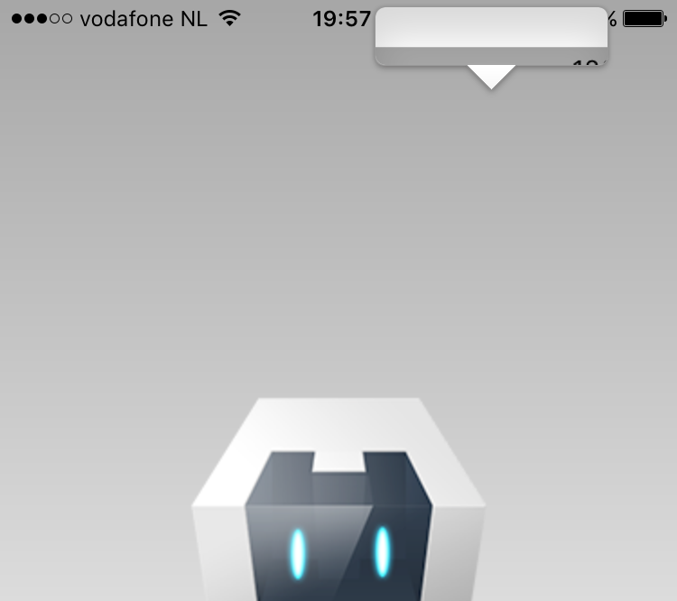

# Cordova iOS LongPress Fix Plugin
by Eddy Verbruggen - [@eddyverbruggen](http://twitter.com/eddyverbruggen)


## Description

Apple thought it'd be nice to show a magnifying glass when longpressing the webview on iOS9.

Don't like it? This plugin removes it!




## Installation

Cordova CLI
```
$ cordova plugin add cordova-plugin-ios-longpress-fix
```

PhoneGap Build
```xml
<gap:plugin name="cordova-plugin-ios-longpress-fix" source="npm" />
```


## Usage
It just works, and will proudly shout that at the XCode console when it does.

### 3D Touch
You can also suppress 3D Touch longpresses (those will also popup the magnifying glass),
but since it requires a bit of caution I've made it optional.

The caveat is `onclick` taps must be completed in under 80ms (otherwise they are hijacked by this plugin) which is too short for most users.
But if you're using `ontouchend` there's no problem.

If you want to enable this feature, add this to `config.xml`:
```xml
  <preference name="Suppress3DTouch" value="true" />
```

## Limitations
Currently only works with UIWebView, not WKWebView, but you should be able to
suppress the magnifying glass on WKWebView with a few lines of CSS.


## Future
I'm working with Cordova guys to get this in their distribution as standard.
